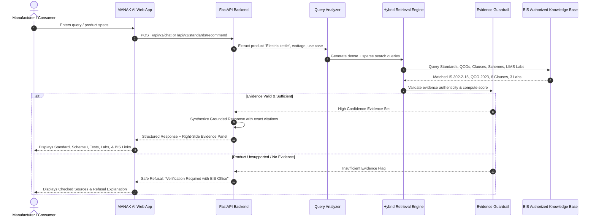

# MANAK AI — System Architecture & Workflow Specification

## What is BIS?
The **Bureau of Indian Standards (BIS)** is the National Standard Body of India established under the **Bureau of Indian Standards Act, 2016**. Operating under the aegis of the **Department of Consumer Affairs, Ministry of Consumer Affairs, Food and Public Distribution, Government of India**, BIS is responsible for:
1. **Harmonious Development of Standardization**: Formulating national standards (**Indian Standards - IS**) covering 15 distinct technical departments (Electrotechnical, Mechanical, Chemical, Civil, Food & Agriculture, Petroleum, Electronics, Medical Equipment, etc.).
2. **Conformity Assessment & Product Certification**: Operating certification schemes—most notably the **ISI Mark (Scheme I)** and **Compulsory Registration Scheme (CRS, Scheme II)**—granting licences to manufacturers whose products conform to Indian Standards.
3. **Quality Control Orders (QCOs)**: While certification is historically voluntary, the Central Government regularly notifies mandatory QCOs for goods concerning human health, safety, the environment, and deceptive practices. Over 600+ products currently fall under compulsory certification where manufacturing, importing, or selling without an ISI mark is punishable under criminal and civil law.
4. **Hallmarking of Precious Metals**: Administering the mandatory hallmarking of gold and silver jewellery/artefacts with laser-inscribed 6-digit **Hallmark Unique Identification (HUID)** numbers.
5. **Laboratory Network (BIS LIMS)**: Managing 10 BIS-owned regional/central testing laboratories alongside 420+ BIS-recognized and 140+ empanelled independent laboratories to test products against prescribed standards.
6. **Consumer Protection**: Enabling citizens to verify genuine ISI licences, HUID numbers, and register grievances through the **BIS CARE** mobile application and web portals.

---

## 1. High-Level Architecture Diagram

```
                                  USER INTERFACE
          (React 19 + TypeScript + Vite + Tailwind CSS + Lucide Icons)
                                       │
                      HTTPS / JSON REST API & Streaming
                                       ▼
                       FASTAPI ASYNC BACKEND (Python 3.13)
 ┌────────────────────────────────────────────────────────────────────────────┐
 │  ROUTER & MIDDLEWARE LAYER                                                │
 │  • CORS, Security Headers, Rate Limiting, Request Logging, Latency Timer   │
 └─────────────────────────────────────┬──────────────────────────────────────┘
                                       │
                ┌──────────────────────┴──────────────────────┐
                ▼                                             ▼
     KNOWLEDGE RETRIEVAL SERVICE                   QUERY & REASONING PIPELINE
 ┌───────────────────────────────┐             ┌───────────────────────────────┐
 │ • SQLite / Postgres Database  │             │ • Intent Classifier           │
 │ • Inverted Keyword Index      │             │ • Product Attribute Extractor │
 │ • TF-IDF / Cosine Dense Search│             │ • Normalization Engine        │
 │ • Clause & Source Index       │             │ • Multilingual Handler        │
 └──────────────┬────────────────┘             └──────────────┬────────────────┘
                │                                             │
                └──────────────────────┬──────────────────────┘
                                       ▼
                         HYBRID RETRIEVAL & FUSION
                     (Reciprocal Rank Fusion - RRF)
                                       │
                                       ▼
                          NEURAL RE-RANKING STAGE
                                       │
                                       ▼
                       EVIDENCE & GROUNDING GUARDRAIL
            ┌────────────────────────────────────────────────────┐
            │ • Source Authority Check (Level 1-4 BIS Sources)  │
            │ • Strict Grounding Verification                   │
            │ • Evidence Score (HIGH / MEDIUM / LIMITED)        │
            │ • Polite Refusal Trigger if Unsupported           │
            └──────────────────────────┬─────────────────────────┘
                                       │
                       ┌───────────────┴───────────────┐
                       ▼                               ▼
                 ENOUGH EVIDENCE              INSUFFICIENT EVIDENCE
                       │                               │
                       ▼                               ▼
             GROUNDED AI SYNTHESIS            TRANSPARENT REFUSAL
             • Product Identified             "Verification Required.
             • Applicable Standard(s)          No authorized BIS source
             • QCO & Mandatory Status          found for this product."
             • Step-by-Step Certification
             • Mandatory Tests
             • Authorized LIMS Labs
             • Traceable Citations
```

---

## 2. End-to-End Decision Workflow

When a manufacturer asks:
> *"I want to manufacture an electric kettle in India. Which Indian Standard applies, is BIS certification required, what tests are needed, and where can I get the product tested?"*



---

## 3. Technology Stack Locked In

| Tier | Technology | Purpose |
|---|---|---|
| **Frontend** | React 19, TypeScript, Vite | Fast, responsive web application for all devices |
| **Styling** | Tailwind CSS, Lucide React | Modern Indian compliance intelligence design |
| **Backend** | Python 3.13, FastAPI, Pydantic v2 | High-throughput asynchronous REST API |
| **System of Record** | SQLite / SQLAlchemy / PostgreSQL | Relational store for standards, QCOs, schemes, labs |
| **Retrieval Engine** | Hybrid Dense + Sparse BM25 + RRF | Accurate exact-identifier (IS code) and semantic match |
| **Guardrails** | BIS Grounding & Citation Validator | Prevents hallucination, computes evidence strength |
| **Deployment** | Docker, Docker Compose, Nginx | Reproducible production containerization |
